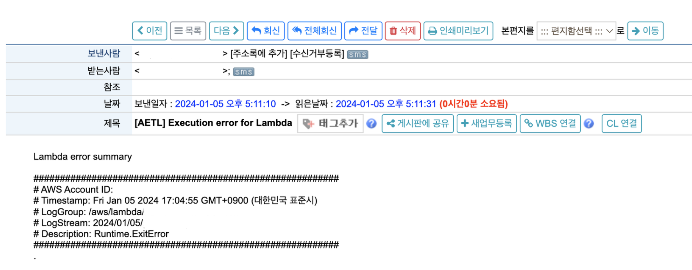

# AWS_alarm
문자, 메일, slack으로 알람 받기 

#### Architecture


# 문자
- [ ] 현재 서울 리전에서는 사용할 수 없는 서비스 -> 가까운 도쿄 리전 사용
- [ ] 주의할 점 
    1. 확인된 대상 전화번호로만 SMS 메시지를 보낼 수 있음
    2. 확인된 대상 전화번호는 10개까지 보유 가능
    3. 마지막 확인 시도 이후 24시간 이상 경과한 후에만 대상 전화번호 삭제 가능 
- [ ] Amazon SNS > Mobile > Text messaging(SMS) > Text messaging preferences
    1. 기본 메시지 유형 : Transactional 
    2. 계정 지출 한도 -> 1달러(개발 용도, 실서비스는 트래픽에 맞춰 설정 필요) 
- [ ] alarm-mobile.mjs 실행 
- [ ] 실행 결과

- 참고 : https://any-ting.tistory.com/96

# 이메일
- [ ] 이메일 등록 및 인증하기 
    - Amazon SES > Create identify 
        - Email address > email 입력 > Create identify
        - 입력한 이메일로 전송된 확인 이메일 인증
- [ ] CloudWatch Logs trigger 받기
    - trigger 받을 람다 함수의 CloudWatch Logs Group 선택
    - filter pattern 생성 : 예) Runtime.ExitError, Task timed out, 4xx, 5xx ...(현재 한 필터당 하나의 패턴만 정의됨 -> 정규표현식 필요)
    - filter pattern 생성시 유의할 점
        - 한 서비스에 대해서 최대 2개까지의 filter pattern 사용 가능
        - 이름 중복 불가
- [ ] trigger 생성 후, 제대로 event 값을 받아오는지 확인 필요 
- [ ] 샘플 1 : apigw - Request too long


- [ ] 샘플 2 : lambda - Runtime.ExitError


- [ ] 샘플 3 : lambda - Task timed out


# Slack
- [ ] slack - Webhooks Url 생성
    - slack 접속 > 사용할 채널 클릭 > 통합 > 앱 추가 클릭 > Incoming WebHooks 설치 > 사용할 채널 기입 및 수신 웹후크 통합 앱 추가 > url 복사
    - 호출 테스트 : postman(body 값 아무거나 테스트 가능)
- [ ] ```npm install @slack/webhook``` 진행
- [ ] 대상 함수의 API CloudWatchLogs를 trigger로 설정
- [ ] 로컬 환경에서 먼저 테스트 후, Slack 알림 받아올 때까지 충분히 테스트 필요
- [ ] 샘플

- 참고 : https://www.notion.so/Amazon-SNS-cdbc7d0ec34b4809984d61aead9c7929?pvs=4 